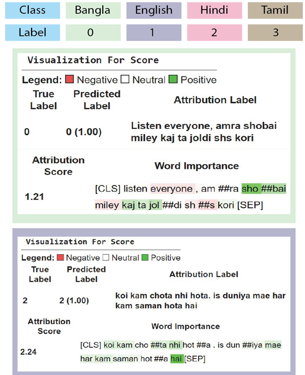
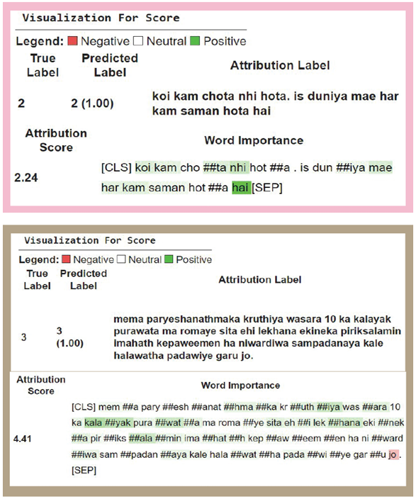
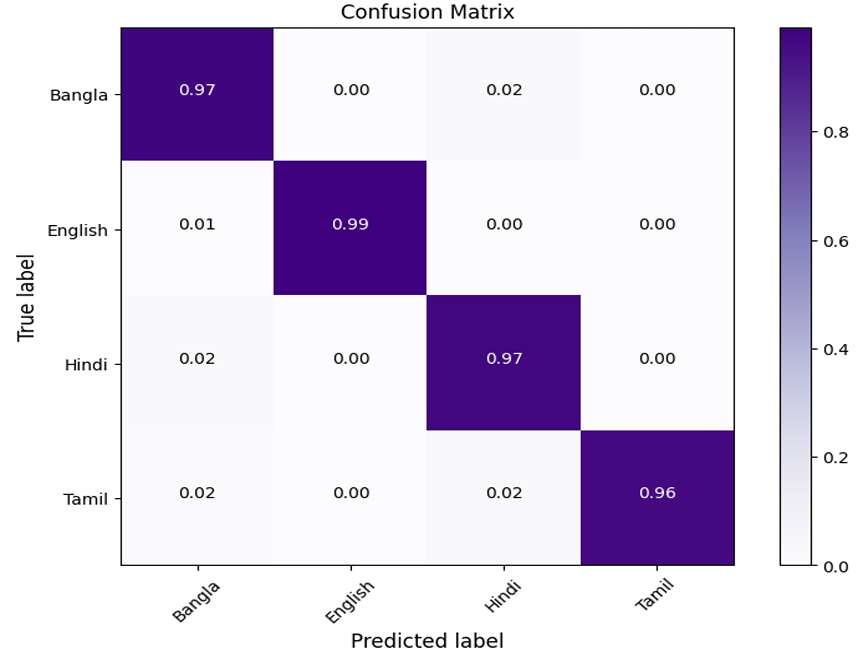

# Transliteration Language Identification using BERT-BiGRU

## Overview
In this project, we developed a **hybrid deep learning model** for **transliteration language identification** using **BERT** and **Bidirectional Gated Recurrent Unit (BiGRU)**. Our model effectively identifies languages in **Bangla, Hindi, Tamil, and English** by leveraging a newly curated transliteration dataset. The **BERT-BiGRU** model outperforms traditional approaches with high accuracy and robust evaluation metrics.

## Key Features
- **Transliteration Dataset Creation**: Collected and preprocessed language data from 12 different datasets.
- **Hybrid Model Architecture**: Combines **BERT** for contextualized embeddings and **BiGRU** for sequential learning.
- **Benchmark Performance**:
  - **Accuracy**: 98.77%
  - **F1 Score**: 97.57%
  - **Specificity**: 99.15%
  - **Matthews Correlation Coefficient (MCC)**: 96.74%
- **Explainability with Layer Integrated Gradients**: Interprets model decisions by highlighting influential linguistic features. Layer Integrated Gradients is an **Explainable AI (XAI) method** that helps understand which input features contribute the most to a model’s predictions by computing attributions across multiple steps from a baseline input to the actual input.



## Dataset
Our dataset consists of **4 languages (Bangla, Hindi, Tamil, and English)** extracted from **12 distinct sources**. Preprocessing includes **tokenization, normalization, and transliteration mapping**.

## Model Architecture
The model comprises:
1. **BERT (Bidirectional Encoder Representations from Transformers)**: Extracts deep contextual embeddings.
2. **BiGRU (Bidirectional Gated Recurrent Unit)**: Captures sequential dependencies in transliterated text.
3. **Fully Connected Layers**: Classifies the input into the respective language.

## Results
The model achieves state-of-the-art performance, surpassing baseline models in transliteration language identification. The use of **Layer Integrated Gradients** further enhances interpretability by revealing important linguistic cues used in classification.


## Citation
If you use this work, please cite:
```
@inproceedings{Islam2024,
  author    = {Islam, Saiful and Md Jabed Hosen and Fowzia Rahman Taznin and Naznin Sultana and Md Injamul Haque and Shakil Rana},
  title     = {An Efficient Framework for Transliteration Sentence Identification of Low Resource Languages Using Hybrid BERT-BiGRU},
  booktitle = {2024 15th International Conference on Computing Communication and Networking Technologies (ICCCNT)},
  pages     = {1-8},
  publisher = {IEEE},
  year      = {2024},
  doi       = {10.1109/ICCCNT61001.2024.10725039}
}
```

## License
This project is licensed under the AGPL-3.0 license - see the [LICENSE](LICENSE) file for details.

